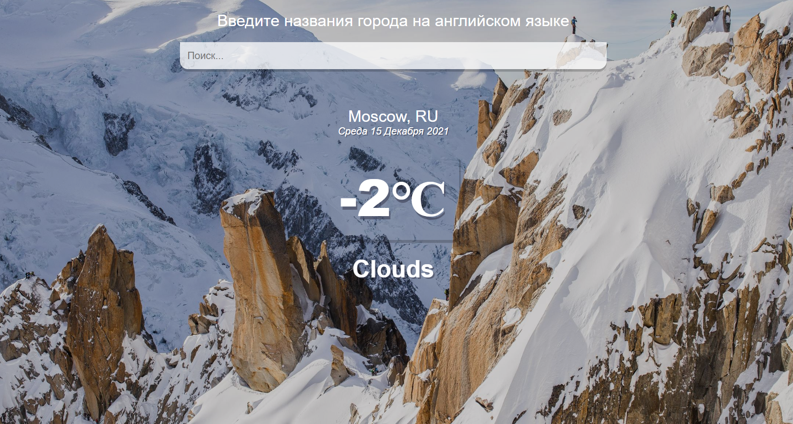
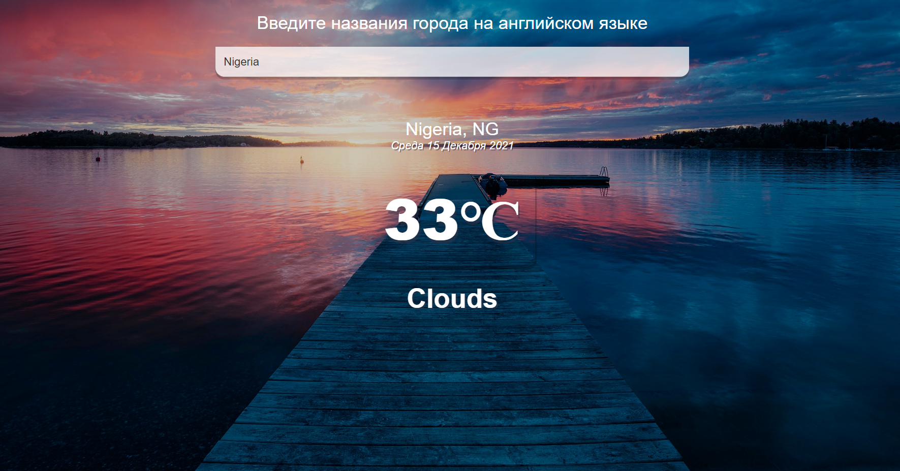
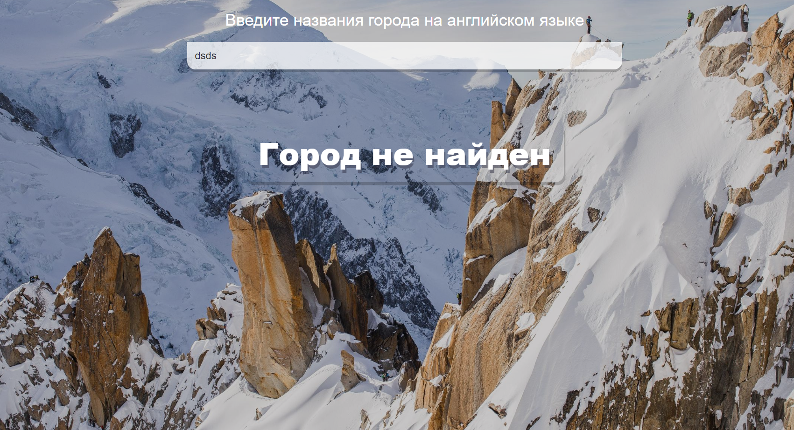

# Парсер погоды работающий с помощью openweathermap
Ссылка на Api: 

https://openweathermap.org/

# Скрин работы программы при температуре < 16 ℃

# Скрин работы программы при температуре > 16 ℃

# Скрин работы программы, с некорретным вводом города

# Ссылка на проект: 
https://seylem-code.github.io/weather-react/